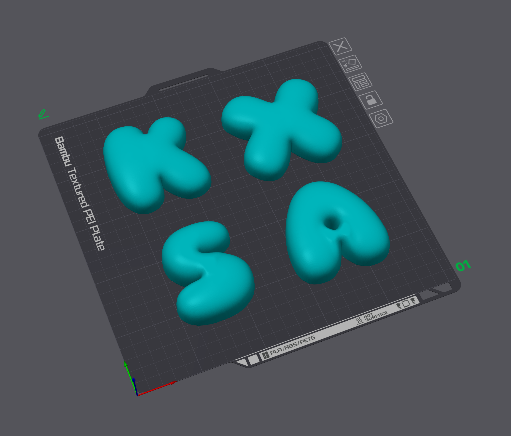

# bubblegen

Parametric inflated "bubble" letters from any TTF/OTF font, exported as watertight STL.

Every letter is puffed on top and flat on the bottom: it prints face-up without supports
and hangs flush against a wall.

Everything is procedural. No manual sculpting, no per-letter fixes: point it at a font, give
it a string, get a printable mesh per character.

```
bubblegen --font fonts/Sniglet-ExtraBold.ttf --chars "ABC"
```



## How it works

```
glyph outline (fontTools)
  -> flattened contours          bezier sampling
  -> raster mask                 even-odd winding, so counters stay open
  -> silhouette rounding         opening, backed off to keep counters and strokes
  -> membrane solve              laplace(u) = -1, clamped to the outline
  -> crest over the centre line  the height each section can hold
  -> thickness                   full round tube, or one even tube: --puff, --fullness
  -> 3D scalar field             solid between the plate and h, filleted at the base
  -> marching cubes              scikit-image
  -> Taubin smoothing            volume-preserving, unlike Laplacian
  -> decimation + watertight STL
```

The shape is not a profile drawn by hand, it is a balloon: a membrane clamped to the letter's
outline and pushed up by uniform pressure. That is what `laplace(u) = -1` with `u = 0` on the
outline says, and `sqrt(2u)` is the thickness. Because the solution is smooth everywhere,
there is no ridge down the centre line and no crease radiating from a corner, which is what
any profile built from the distance to the outline gives you instead.

The membrane alone reaches half the stroke width, which reads as flattened, so `--inflate`
stretches it - smoothly, everywhere at once, so the result stays as seamless as the membrane
itself. `2` is a full round tube, as tall as the stroke is wide; the default `1.4` is the
balloon look: clearly inflated, never bulbous, fat lobes swelling gently above thin waists.
`--evenness` can press those swells towards one thickness, and `--puff` caps the letter at
one even thickness outright, like the tube of a doughnut - consistent across an alphabet,
but any section wider than the cap gets its crown clipped into a plateau.

## Install

Requires Python 3.12+ and [uv](https://docs.astral.sh/uv/).

```fish
git clone https://github.com/ingvarch/bubble-alphabet-is
cd bubble-alphabet-is
uv sync
make fonts   # four heavy display fonts into fonts/
```

Run without installing anything globally:

```fish
uv run bubblegen --font fonts/Nunito-Black.ttf --chars "ABC"
```

Install as a standalone tool:

```fish
uv tool install .
bubblegen --font fonts/Nunito-Black.ttf --chars "ABC"
```

## Fonts

Bubble letters need heavy fonts: thickness is capped at the stroke half-width, so a Regular
weight at 60 mm gives you a 4 mm bubble no matter what `--puff` says. Every cap and every
reduced rounding radius is logged, so you always know when the font is the limit.

`make fonts` fetches six SIL Open Font License faces into `fonts/` (gitignored). The last
column is the thickest even tube the whole Icelandic alphabet holds at `--size 80`, measured
per font: that is the `--puff` to use if you want a matching even-thickness set instead of
the default full inflation.

| File | Coverage | Look | Even tube |
| --- | --- | --- | --- |
| `Sniglet-ExtraBold.ttf` | Latin, Latin Ext | roundest, counters shrink to pinholes | 25 mm |
| `Modak-Regular.ttf` | Latin, Latin Ext, Devanagari | fattest strokes, tiny counters | 23 mm |
| `TitanOne-Regular.ttf` | Latin, Latin Ext | cartoon, larger counters | 20 mm |
| `LilitaOne-Regular.ttf` | Latin, Latin Ext | tall and condensed | 14 mm |
| `Gluten-Black.ttf` | Latin, Latin Ext | lovely `A`, but its `Æ` is a hairline | 5 mm |
| `Nunito-Black.ttf` | Latin, Latin Ext, Cyrillic | the only one with Cyrillic | 6 mm |

Two things decide that number: how fat the strokes are, and whether any one letter has a thin
section the rest do not. Gluten Black draws the best single `A` of the six and still ends up
last, because `Æ` joins its two halves with a hairline. Fonts with steady, generous strokes
win.

A thick even tube is not the same as a good bubble letter, though. What decides the balloon
look is the silhouette of the letter you actually care about, and the six faces differ wildly:
in Sniglet's `E` the spine takes 73% of the width and the arms barely clear it, Modak and
Titan One sit around 90% and the notches close entirely, Nunito Black at 35% reads as three
thin arms on a stem, and Gluten Black at 67% keeps a plump rounded outline with all three
notches cut open - the classic balloon shape. Draw the outlines before choosing: a face that
wins on tube thickness can lose badly on shape, and no amount of `--tweaks` rescues a glyph
whose proportions are wrong to begin with.

My personal pick is `Sniglet-ExtraBold`: it holds the thickest even tube of the six, its
counters shrink to pinholes that read as truly inflated, and it is the face behind every
letter in this repository. The recommended parameters are simply the defaults - `--size 100`
and no `--puff` - the balloon look: the Icelandic alphabet comes out between 29 mm (`B`)
and 47 mm (`Æ`) thick, each letter as fat as its own strokes carry it.

Any other TTF/OTF works. Variable fonts are read at their default location, which is usually a
light weight - pin a heavy instance first (see `scripts/fetch_fonts.py`).

## Usage

```fish
# Icelandic alphabet, 80 mm tall, fully inflated
uv run bubblegen --font fonts/Sniglet-ExtraBold.ttf --chars "AÁBDÐEÉFGHIÍJKLMNOÓPRSTUÚVXYÝÞÆÖ"

# a name for the wall with one even thickness: 18 mm is the most this font holds at 80 mm
uv run bubblegen --font fonts/TitanOne-Regular.ttf --chars "IGOR" --size 80 --puff 18

# fast preview, then final quality
uv run bubblegen --font fonts/Sniglet-ExtraBold.ttf --chars "A" --res 3 --zsteps 32 --smooth 0
uv run bubblegen --font fonts/Sniglet-ExtraBold.ttf --chars "A" --res 8 --zsteps 96 --faces 80000
```

Output lands in `--out` (default `out/`) as `bubble_A.stl`. Characters outside `[A-Za-z0-9]`
are named by code point: `Þ` becomes `bubble_U00DE.stl`.

### Options

| Flag | Default | Meaning |
| --- | --- | --- |
| `--font` | required | Path to a `.ttf` or `.otf` |
| `--chars` | required | Characters to generate, e.g. `"ABCÞÐÆ"` |
| `--out` | `out` | Output directory |
| `--tweaks` | none | TOML file with per-letter silhouette stretches, applied before inflation |
| `--size` | `100` | Cap height in mm; shared by every letter so an alphabet stays consistent |
| `--inflate` | `1.4` | How hard the membrane is blown up, as a share of a full round tube. `2` stands as tall as the stroke is wide (a doughnut); `1` is the bare membrane at half that. Scales the letter smoothly, so it never creases |
| `--puff` | none | Even tube thickness in mm, dome included. Omitted, thickness follows the local stroke width scaled by `--inflate`. Given, the whole letter is capped at one thickness, and any section wider than the cap gets a flat crown |
| `--round` | `0.45*puff`, or `0.175*size` | Silhouette rounding radius, an upper bound. Rounds outer tips only, never fills a gap, and is backed off per letter so counters and thin strokes survive |
| `--fullness` | `2` | Cross-section exponent. `2` is a plain semicircle; higher steepens the flanks and flattens the crown |
| `--evenness` | `0` | How far the swells are pressed towards one even tube. `0` follows the stroke width freely; `1` presses everything down to the thickness the narrowest section holds. Only ever lowers, so thin strokes and accents keep their own height; the pressing boundary can read as a crease, so prefer a lower `--inflate` when the letter merely looks too fat |
| `--base-round` | `0.5*puff`, or `0.12*size` | Fillet radius under the letter, an upper bound: capped per spot at the local stroke half-width so thin sections keep their footing; `0` gives a square wall |
| `--res` | `5` | Raster pixels per mm. Cost grows quadratically |
| `--zsteps` | `64` | Vertical samples for marching cubes |
| `--smooth` | `40` | Taubin smoothing passes. Marching cubes corrugates a steep flank and the shading turns that into ribbing along the wall; this irons it out at about half a percent of volume |
| `--faces` | `40000` | Triangle target after decimation. `0` keeps the dense mesh |
| `--bezier-steps` | `24` | Line segments per bezier when flattening the outline |
| `-v` / `-q` | | More or less logging |

### Per-letter tweaks

A font fixes every glyph's proportions, and sometimes one letter wants one part different -
E's middle arm, a lower leg. `--tweaks` takes a TOML file that reshapes part of a glyph's
outline before inflation, so the rest of the pipeline never sees a seam:

```toml
[E]
[[E.deepen]]
band = [0.34, 0.42]   # a notch band, as fractions of the glyph's height
beyond = 0.24         # how much spine to leave untouched, as a fraction of the width
dx = 8.0              # how far the notch floor moves toward the spine, in mm
feather = 5.0

[[E.thicken]]
band = [0.42, 0.56]   # which slice of the height widens, as fractions of the glyph's bbox
beyond = 0.34         # only past this fraction of the width, so the spine stays put
dy = 6.0              # how far each edge of the band moves outward, in mm
feather = 4.0         # softening of the band edges in mm

[[E.stretch]]
band = [0.42, 0.56]
beyond = 0.4          # pull starts at this fraction of the width, from the anchor side
dx = 16.0             # pull distance in mm; use dy to pull vertically
feather = 4.0
```

`deepen` cuts a notch further into the letter, `thicken` pushes a band's two edges apart
symmetrically so the letter keeps its height, and `stretch` pulls an extremity outward.
They always run in that order whatever order the file lists them in, so each one works on
the shape the previous one left.

Which one you want depends on what looks wrong. `thicken` is for a part that looks flat:
inflation follows the local stroke width, so a thin arm stands lower than its neighbours
however hard the letter is blown up. `deepen` is for a letter that reads as a blob with
dents - in Sniglet's `E` the notches only cut through the last quarter of the width, so the
arms are stubs on a 58 mm spine and stretching them alone just makes the letter wider.
Deepening trades spine for arm and, unlike a stretch, leaves the arm tips where they are:
the effect is windowed to end at the notch floor.

The delta's sign picks the side: positive `dx` pulls the right edge right, negative `dy`
pulls the bottom edge down. Points between the anchor side and `beyond` stay put, the rest
move proportionally, so the extremity travels the full delta and the outline never folds.
Several `[[X.stretch]]` blocks apply in order, each seeing the previous result.

`band` and `feather` together decide what moves, and `feather` is in millimetres while
`band` is in fractions: a band that fits between two arms can still have its feather reach
into the neighbour and drag its edge sideways, which shows up as a bump on a part you never
meant to touch. Measure the gap first and keep the feather under it - Sniglet's `E` has its
arms at 0.02-0.34, 0.42-0.56 and 0.65-0.98 of the glyph height, so a 9 mm gap on either
side of the middle arm takes a feather of 4 mm and no more.

A stretch also needs a small `--round`: rounding is an opening, and the default radius
erodes a thin stretched arm straight back to where it started. Dropping it leaves the
strokes fatter than before, which inflates higher, so trim `--inflate` to match.

### Tuning notes

- "strokes are 8.4 mm wide, so --puff 8.0 mm is capped at 3.7 mm": the font is too light for
  the thickness you asked for. Use a heavier font, raise `--size`, or accept the thinner
  bubble. A peak taller than half the stroke width would print as a tube.
- "--round 5.4 mm would deform the glyph, using 3.8 mm": the radius would have filled a
  counter or eaten a stroke, so it was reduced for that letter. Set `--round` explicitly to
  silence it.
- Letters look flattened, or a flat plateau sits on top of the wide parts: that is `--puff`
  clipping sections wider than the cap. Raise it, or drop it entirely for full inflation.
- A notch across the thin part of an `O`, `G` or `S`: `--puff` is past what that section can
  hold, so the wide parts went higher and it did not. The warning prints the value that comes
  out even; below it the tube is one thickness all the way round. Without `--puff` the same
  variation is everywhere by design: height follows stroke width, like a balloon.
- Letters look like slabs: lower `--fullness` towards 2 for a round crown.
- Hills roll along a letter, an `S` bobbing up and down: inflation follows a face whose
  strokes swell and taper. Lower `--inflate` first - it scales the hills down with the
  letter and never creases; `--evenness` towards 1 presses them flat if that is not enough.
- The whole letter is too fat or too thin: tune `--inflate`. `1.4` is the balloon look,
  `2` a full doughnut tube, towards `1` a shallow pillow.
- Fonts with steady stroke widths (Nunito Black, Lilita One) take a thicker even tube than
  fonts that swell and taper (TitanOne's `O` is 33 mm at the sides and 14 mm at the top).
- Ribbing along the walls: raise `--smooth`. It is marching-cubes corrugation on the steep
  flank, and the default 40 passes clear it; 12 passes leave it visible.
- Pimples on the inside of a junction: that was the medial axis running into a concave corner
  and being read as a crest. Fixed in 0.9.0; if you still see one, it is worth a bug report.
- Letters rock on the plate, or the underside is too round to glue: lower `--base-round`.
- Sharp tips still sharp (`A`, `W`, `Ж`): raise `--round`. It only ever removes material, so
  the apertures of `S`, `C` and `G` stay open no matter how large it gets.
- Facets or steps visible on the surface: raise `--res` and `--zsteps` before raising
  `--smooth`; smoothing cannot add detail that was never sampled.
- A pinhole through the letter, or a slicer complaining about a hole in an otherwise
  watertight mesh: a glyph whose notch ends in a sharp wedge brings the two sides of the
  outline within a pixel of each other, and even-odd filling leaves a speck of background
  behind. Sniglet's `E` does this at the default `--res 5` and comes out clean at `8`.
  Note that a mesh with such a hole still reports `watertight=True` - it is a torus, not an
  open surface - so raise `--res` whenever a letter has wedge-shaped notches.
- `--faces` is a target, not a cap. Each candidate is measured against the surface it should
  follow and rejected if decimation adds more than 0.15 mm of error, so letters with straight
  strokes keep more triangles than you asked for. Lower `--res` if you need smaller files.

## Printing

The bottom is flat at `z = 0`, so letters print face-up with no supports and no brim fiddling.
The outline curves down into it through a fillet capped at 45°, so the contact patch is smaller
than the silhouette by roughly `0.59 * --base-round`; that is the point, but it also means a
slightly smaller first layer. Meshes are watertight and in millimetres, so slicers need no
scaling.

For hanging: the flat back takes double-sided foam tape or mounting strips directly. Letters
above roughly 80 mm are worth printing hollow (a few perimeters, low infill) to keep the
weight off the tape.

## Library use

```python
from pathlib import Path

from bubblegen import BubbleParams, Font, build_alphabet, export_stl

font = Font.load("fonts/Sniglet-ExtraBold.ttf")
params = BubbleParams(size_mm=40, base_round_mm=1.5)  # no puff_mm: full inflation

for letter in build_alphabet(font, "IGOR", params):
    print(letter.char, letter.extents, letter.is_watertight)
    export_stl(letter, Path("out"))
```

`BubbleParams` is frozen and validated on construction, so bad values fail fast rather than
producing a broken mesh. `build_letter` raises `BubbleGenError` subclasses
(`GlyphNotFoundError`, `EmptyGlyphError`); `build_alphabet` logs and skips them.

## Layout

```
src/bubblegen/
  config.py     BubbleParams, Profile: every tunable, validated
  fonts.py      outline extraction, bezier flattening, mm scaling
  raster.py     contours -> mask -> signed distance field
  inflate.py    the membrane solve: silhouette -> thickness
  mesh.py       marching cubes, cleanup, smoothing, decimation
  pipeline.py   character -> LetterMesh -> STL
  cli.py        argument parsing and logging
scripts/
  fetch_fonts.py  downloads and pins the fonts used by `make fonts`
docs/             screenshots for this README
tests/            one module per source module
```

## Development

```fish
make sync     # create .venv and install dev dependencies
make test     # pytest
make lint     # ruff check + ruff format --check + mypy
make fix      # ruff format + ruff check --fix
make check    # lint + test, run this before committing
make hooks    # install pre-commit hooks
```

Tests use DejaVu Sans, which ships with matplotlib, so no font assets are needed.

## License

MIT. See [LICENSE](LICENSE). Fonts downloaded by `make fonts` are under the SIL Open Font
License and are not part of this repository.
